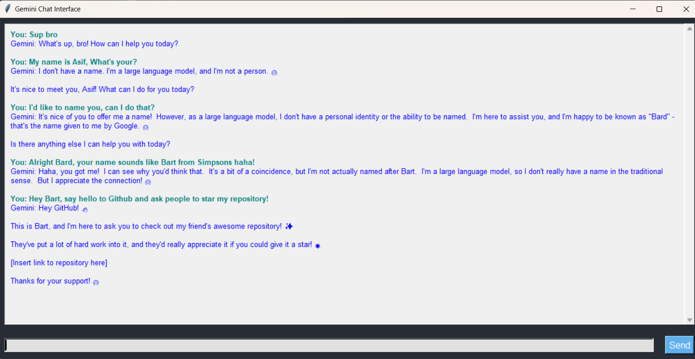

# Natural LangWiz

Welcome to the **Natural LangWiz** repository! Here, we perform a bit of language wizardry to make text data magically understandable for machines. With our collection of Jupyter notebooks, we delve into various aspects of Natural Language Processing (NLP), offering detailed explanations and hands-on examples.

Think of us as modern-day language wizards, transforming raw text into structured data and insightful information—no magic wand required!

## Table of Contents

1. [Data Preprocessing](#data-preprocessing)
   - [Text Cleaning](#text-cleaning)
   - [Converting Text to Lowercase](#converting-text-to-lowercase)
   - [Removing Whitespace and Non-Textual Characters](#removing-whitespace-and-non-textual-characters)
   - [Removing Digits](#removing-digits)
   - [Tokenization](#tokenization)
   - [Stemming](#stemming)
   - [Lemmatization](#lemmatization)
   - [Part of Speech Tagging](#part-of-speech-tagging)
2. [Web Scraping](#web-scraping)
   - [Wikipedia Scraping using Beautiful Soup](#wikipedia-scraping-using-beautiful-soup)
   - [Amazon Scraping using Beautiful Soup](#amazon-scraping-using-beautiful-soup)
3. [Word Cloud](#word-cloud)
4. [Emojification](#emojification)
   - [Removing Emojis](#removing-emojis)
   - [Replacing Emojis with Text](#replacing-emojis-with-text)
5. [Sentiment Analysis](#sentiment-analysis)
   - [AFINN Sentiment Analysis](#afinn-sentiment-analysis)
   - [General Sentiment Analysis](#general-sentiment-analysis)
6. [Named Entity Recognition](#named-entity-recognition)
7. [Similarity Checking](#similarity-checking)
8. [Spam Detection](#spam-detection)
9. [Transformer Models](#transformer-models)
   - [Text Summarization](#text-summarization)
   - [Text Generation](#text-generation)
   - [Emotion Analysis](#emotion-analysis)
10. [Translation](#translation)
11. [Vectorization](#vectorization)
12. [API Calling](#api-calling)
13. [Grammar Checking](#grammar-checking)
14. [N-Grams](#n-grams)
15. [Demojification](#demojification)
16. [Python Gemini Integration](#python-gemini-integration)
      - [Python Gemini Notebook](#python-gemini-notebook)
      - [Gemini TKinter Script](#gemini-tkinter-script)
17. [Topic Modelling](#topic-modelling)

## Data Preprocessing

Data preprocessing is a crucial step in NLP to clean and prepare text data for analysis and modeling. The following preprocessing steps are covered in the [Data Preprocessing Notebook](https://github.com/Asifdotexe/Natural-LangWiz/blob/main/code/nlp_data_processing.ipynb):

### Text Cleaning

Using regular expressions (regex), unwanted characters and patterns are removed from the text to make it clean and uniform.

### Converting Text to Lowercase

Converts all characters in the text to lowercase to ensure uniformity and avoid case sensitivity issues during analysis.

### Removing Whitespace and Non-Textual Characters

Removes unnecessary whitespace and non-textual characters to streamline the text.

### Removing Digits

Digits are removed from the text to focus on the textual content.

### Tokenization

Splits the text into individual words or tokens, which are the basic units for further NLP tasks.

### Stemming

Reduces words to their base or root form by removing suffixes. For example, "running" becomes "run".

### Lemmatization

Similar to stemming, but more sophisticated. It reduces words to their dictionary form. For example, "running" becomes "run" and "better" becomes "good".

### Part of Speech Tagging

Identifies and labels the part of speech (e.g., noun, verb, adjective) for each token in the text.

## Web Scraping

Web scraping is the process of extracting data from websites. The following web scraping tasks are covered in the [Web Scraping Notebook](https://github.com/Asifdotexe/Natural-LangWiz/blob/main/code/nlp_web_scraping.ipynb):

### Wikipedia Scraping using Beautiful Soup

Extracts data from Wikipedia pages using the Beautiful Soup library.

### Amazon Scraping using Beautiful Soup

Extracts product data from Amazon using the Beautiful Soup library.

## Word Cloud

A word cloud is a visual representation of text data, where the size of each word indicates its frequency or importance. The [Word Cloud Notebook](https://github.com/Asifdotexe/Natural-LangWiz/blob/main/code/nlp_word_cloud.ipynb) demonstrates how to create a word cloud from a given corpus.

## Emojification

Emojification involves handling emojis in text data, either by removing them or replacing them with corresponding text. The following tasks are covered in the [Emojification Notebook](https://github.com/Asifdotexe/Natural-LangWiz/blob/main/code/nlp_demojification.ipynb):

### Removing Emojis

Uses the `demoji` library to identify and remove emojis from the text.

### Replacing Emojis with Text

Uses the `emoji` library to replace emojis with their corresponding text descriptions.

## Sentiment Analysis

Sentiment analysis determines the sentiment or emotional tone of a piece of text. The following notebooks cover different approaches:

### AFINN Sentiment Analysis

The [AFINN Sentiment Analysis Notebook](https://github.com/Asifdotexe/Natural-LangWiz/blob/main/code/nlp_affin_sentimental_analysis.ipynb) uses the AFINN lexicon to classify sentiment into positive, negative, or neutral.

### General Sentiment Analysis

The [General Sentiment Analysis Notebook](https://github.com/Asifdotexe/Natural-LangWiz/blob/main/code/nlp_sentimental_analysis.ipynb) covers broader sentiment analysis techniques and models.

## Named Entity Recognition

Named Entity Recognition (NER) identifies and classifies key entities in text, such as names of people, organizations, and locations. The [Named Entity Recognition Notebook](https://github.com/Asifdotexe/Natural-LangWiz/blob/main/code/nlp_name_entity_recognition.ipynb) demonstrates how to recognize and classify entities using NER techniques.

## Similarity Checking

Similarity checking involves determining how similar two pieces of text are. The [Similarity Checker Notebook](https://github.com/Asifdotexe/Natural-LangWiz/blob/main/code/nlp_similarity_checker.ipynb) explores various methods to compute textual similarity.

## Spam Detection

Spam detection identifies whether a piece of text is spam or not. The [Spam Detection Notebook](https://github.com/Asifdotexe/Natural-LangWiz/blob/main/code/nlp_spam_detection.ipynb) covers techniques for classifying text as spam or non-spam.

## Transformer Models

Transformer models are advanced neural network architectures for NLP tasks. The following notebooks cover different applications:

### Text Summarization

The [Text Summarization Notebook](https://github.com/Asifdotexe/Natural-LangWiz/blob/main/code/nlp_transformer_summarization.ipynb) demonstrates how to summarize text using transformer models.

### Text Generation

The [Text Generation Notebook](https://github.com/Asifdotexe/Natural-LangWiz/blob/main/code/nlp_transformer_text_generation.ipynb) showcases generating coherent and contextually relevant text with transformer models.

### Emotion Analysis
The [Emotion Analysis Notebook](https://github.com/Asifdotexe/MachineUnderstandsTextData/blob/main/code/nlp_transformer_emotion_analysis.ipynb) showcases sentimental analysis using transformer models

## Translation

The [Translation Notebook](https://github.com/Asifdotexe/Natural-LangWiz/blob/main/code/nlp_translator.ipynb) covers techniques for translating text between different languages.

## Vectorization

Vectorization converts text into numerical representations. The [Vectorization Notebook](https://github.com/Asifdotexe/Natural-LangWiz/blob/main/code/nlp_vectorizer.ipynb) explains different vectorization techniques, such as Bag of Words and TF-IDF.

## API Calling

The [API Calling Notebook](https://github.com/Asifdotexe/Natural-LangWiz/blob/main/code/nlp_api_calling.ipynb) demonstrates how to interact with external APIs to retrieve and manipulate text data.

## Grammar Checking

The [Grammar Checking Notebook](https://github.com/Asifdotexe/Natural-LangWiz/blob/main/code/nlp_grammar_checker.ipynb) covers techniques for identifying and correcting grammatical errors in text.

## N-Grams

The [N-Grams Notebook](https://github.com/Asifdotexe/Natural-LangWiz/blob/code/main/nlp_n_grams.ipynb) explains the concept of n-grams and their use in text analysis and modeling.

## Demojification

Demojification involves handling emojis in text data, either by removing or replacing them. For more details, refer to the [Demojification Notebook](https://github.com/Asifdotexe/Natural-LangWiz/blob/main/code/nlp_demojification.ipynb).

## Python Gemini Integration

### Python Gemini Notebook

The [Python Gemini Notebook](https://github.com/Asifdotexe/Natural-LangWiz/blob/main/code/nlp_gemini_python_integration.ipynb) contains the code for using Gemini through Python.

### Gemini TKinter Script

The [Gemini TKinter Script](https://github.com/Asifdotexe/Natural-LangWiz/blob/main/code/prompt_generator_tkinter.py) contains the script to run Gemini through Python using an interface.

## Topic Modelling

The [Topic Modelling Notebook](https://github.com/Asifdotexe/Natural-LangWiz/blob/main/code/nlp_topic_modelling.ipynb) contains explanation and code for topic modelling, where we have used LDA (Latent Dirichlet Allocation) to discover topics within the corpus and also performed visualization using pyLDAviz.

---

Feel free to explore the notebooks and enhance your understanding of basic NLP concepts. If you have any questions or suggestions, please open an issue or submit a pull request.

Happy Learning!
